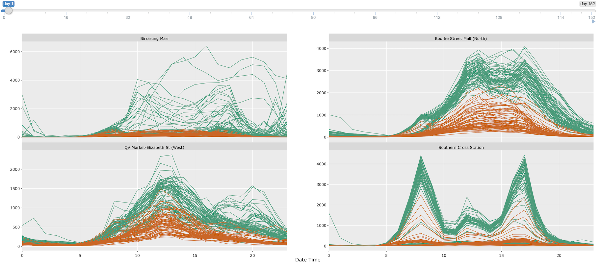
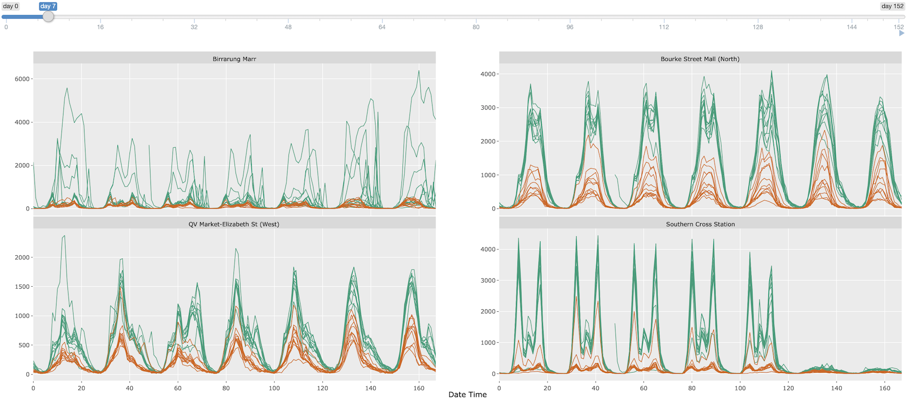

```{r setup, echo = FALSE, cache = FALSE, include = FALSE}
options("knitr.graphics.auto_pdf" = TRUE)
library(knitr)
opts_chunk$set(
  echo = FALSE, warning = FALSE, message = FALSE, comment = "#>",
  fig.path = 'figure/', fig.align = 'center', fig.show = 'hold',
  cache = TRUE, cache.path = 'cache/',
  out.width = ifelse(is_html_output(), "100%", "\\textwidth")
)
opts_knit$set(root.dir = here::here())
read_chunk("scripts/demo.R")
read_chunk("scripts/tourism.R")
read_chunk("scripts/pedestrian.R")
```

```{r, load-pkgs}
```

# Introduction

* An ensemble of graphics
* Accelerate the exploratory data visualization process

# Background: tidy temporal data and workflow

The \CRANpkg{tsibble} package [@wang2020tsibble] introduces a unified temporal data structure, referred to as a `tsibble`, to represent time series and longitudinal data in a tidy format [@wickham2014tidy]. That said, a `tsibble` extends the `data.frame` and \CRANpkg{tibble} class with temporally contextual metadata: `index` and `key`. The `index` declares a data column that holds time-related indices. The `key` identifies a collection of related series or panels observed over the `index`-defined period, which can comprise multiple columns. Below displays the monthly Australian retail trade turnover data (`aus_retail`), available in the \CRANpkg{tsibbledata} package. The `Month` column holds year-months as `index`. The `State` together with `Industry` are the identifiers for these 152 series, highlighted as `key`. Note that the column `Series ID` could be an alternative option for setting up `key`, but `State` and `Industry` are more readable and informative. The `index` and `key` are "sticky" columns to a `tsibble`, forming critical pieces for fluent temporal data analysis later.

```{r, print-retail}
```

In the spirit of tidy data to the \CRANpkg{tidyverse} [@Wickham2019], the **tidyverts** suite features `tsibble` as the foundational data structure, in order to build a fluid and fluent pipeline for time series analysis. Besides \CRANpkg{tsibble}, the \CRANpkg{feasts} and \CRANpkg{fable} packages fill the role of statistical analysis and forecasting in the **tidyverts** ecosystem. When time series analysis starts taking off, series of interest denoted by the `key` variables often remain unchanged over the course of analysis, from trend inspection to forecasting performance.

Figure \ref{fig:highlight-retail-1} gives an overview of 152 series for the retail data using an overlaid time series plot, while Figure \ref{fig:highlight-retail-2} presents a scatterplot, where each series is represented by a dot in the feature space (trend versus seasonal strength). The plot making of Figure \ref{fig:highlight-retail-2} is aided with the `features()` function from \CRANpkg{feasts}, which summarises original data by each series down to various statistical features. This function along with other **tidyverts** functions is `tsibble`-aware, and outputs a table in a reduced form where each row corresponds to a series, thus graphically displayed as Figure \ref{fig:highlight-retail-2}.

```{r highlight-retail, fig.height = 6, out.width = ".49\\linewidth", fig.show = "hold", fig.cap = "ToDo", fig.subcap = c("1", "2"), fig.ncol = 2}
```

Figure \ref{fig:highlight-retail} highlights not only a series with strongest seasonality, but also a need to querying interesting series on the fly. Without interactivity, one needs to first filter the interesting series out from the features table, and join back to the original `tsibble` in order to examine its trend in relation to others. This procedure can soon grow cumbersome if many series to be discovered. Despite that the two plots are static, they can be considered as linked views via the common `key` variables between two tables. This motivates enabling interactivity of `tsibble` and `tsibble`-derived objects for rapid exploratory data analysis.

# Overview of interactivity

* {cranvas} and {cranvastime}
* [crossfilter.js](http://crossfilter.github.io/crossfilter/) & [dc.js](https://dc-js.github.io/dc.js/)
* {crosstalk} and html widgets
* {rJava}, {rbokeh} {loon}

# Interactivity for coordinated views via shared temporal data

The \CRANpkg{tsibbletalk} package, inspired by the \CRANpkg{crosstalk} package, introduces a shared tsibble data structure on top of a `tsibble` to allow for frictionless communication between different plots for temporal data. The `as_shared_tsibble()` function provides an entry point in the integrated flow, turning a `tsibble` to a shared instance (i.e. `SharedTsibbleData` subclassing of `SharedData` from \CRANpkg{crosstalk}) that powers data transmission across multiple views. The \CRANpkg{tsibbletalk} package aims to streamline interactive graphical analysis with the focus of temporal and structured linking.

As opposed to one-to-one linking, \CRANpkg{tsibbletalk} defaults to categorical linking where marking one or more observations in one category will broadcast to all other observations in this category. Given time series plots, click any data point on a line, highlighting the whole line as a result. The `as_shared_tsibble()` uses `tsibble`'s `key` variables to achieve these types of linking, and the `spec` argument takes one step further in constructing hybrid linking, such as hierarchical and categorical linking. For example, each series in the `aus_retail` data corresponds to all possible combinations of the `State` and `Industry` variables. They are intrinsically crossed with each other. If one variable is nested within another, this lends itself to a hierarchical structure, like geographical hierarchy. Such collection of inter-related time series are referred to as hierarchical and grouped time series in the literature [@fpp].

To incorporate structured specifications in the `key`, a symbolic formula can be passed to the `spec` argument. Adopting Wilkinson notations for factorial models [@Wilkinson1973], the `spec` follows the `/` and `*` operators tradition to declare nesting and crossing variables respectively. The `spec` for the `aus_retail` data is therefore specified as `State * Industry` or `Industry * State`, which is the default for the presence of multiple `key` variables. If there is a hierarchy in the data, using `/` is required to indicate the parent-child relation, as strictly one direction `parent/child`.

The `tourism_monthly` dataset packaged in \CRANpkg{tsibbletalk}, contains monthly domestic overnight trips across Australia, to give an illustrator of nesting and crossing. The `key` is comprised of three identifying variables: `State`, `Region`, and `Purpose` (of trip), in particular `State` nesting of `Region`, together crossed with `Purpose`. This specification can be translated as follows:

```{r tourism-shared, echo = TRUE}
```

```{r load-other-pkgs}
```

```{r tourism-linking-fig, fig.cap = "ToDo"}
include_graphics("img/tourism-linking.png")
```

This dataset contains a three-level hierarchy: the root node is implicitly Australia, and geographically disaggregated to states and lower-level tourism regions. A new handy function `plotly_key_tree()` has been implemented to address the need of hierarchical discovery arising from the data. It interprets hierarchies in the shared tsibble's `spec` as a tree view, built with \CRANpkg{plotly}. The following code line produces the linked tree diagram and fills the left panel of Figure \ref{fig:tourism-linking-fig}. The visual of tree hierarchy untangles a group of related series and snapshots the data organisation from a bird's eye view.

```{r plotly-key-tree, echo = TRUE}
```

The tree plot provides backbones of the data, and much flesh yet to be attached. Small multiples of time series lines are composed and placed at the top right of Figure \ref{fig:tourism-linking-fig} to unpack the temporal trend across regions by purposes of trips. The shared tsibble data can be directly piped into \CRANpkg{ggplot2} code.

```{r tourism-series, echo = TRUE, eval = FALSE}
```

To tease apart these overlaid time series, they are funnelled through the `features()` S3 method to extract some key characteristics, including the measurements of trend and seasonality. A scatterplot is populated from these statistics for each series.

```{r tourism-scatter, echo = TRUE, eval = FALSE}
```

Lastly, three graphics are composed as an ensemble of coordinated views for multi-facetted exploration, shown as Figure \ref{fig:tourism-linking-fig} (the interactive realisation of Figure \ref{fig:highlight-retail}). Routine functions bring about new interaction with temporal data on the client side.

```{r tourism-multi, echo = TRUE, eval = FALSE}
```

Since all plots are stemmed from one shared tsibble data source, they are self-linking views. Nodes, lines, and points are hoverable and clickable. Given the `spec`, clicking either one element in any plot highlights all points that match the `Region` category, briefly "categorical linking". In Figure \ref{fig:tourism-linking-fig}, when hovering and selecting the circle associated with "Sydney" in the scatter plot, all data records with shared values of "Sydney" listen and react to this interaction via self updating in red. In order for comparison with other regions or states, press the "Shift" key to enable persistent selection, and simultaneously select the parent node on the tree, saying "Western Australia", to include all the children by switching to the blue colour. The domestic tourism sees Sydney as one of the most popular destinations in realm of business and friends visiting over years. Despite of relatively weaker performance in Western Australia, Australia's North West region sees the strongest upward trend, bypassing Sydney in some years.

In summary, shared tsibble data nicely bridges between the \CRANpkg{crosstalk} and **tidyverts** ecosystems. The `as_shared_tsibble()` provides a symbolic user interface for effortless construction of a hybrid of hierarchical and categorical linkings. And the `plotly_key_tree()` in turn decodes the specification to plot a tree for data overview and navigation, accompanied with more detailed plots.

# Slicing and dicing time

The shared tsibble data leverages the `key` attribute to converse with many coordinated views, with or without \CRANpkg{shiny}. On the other hand, a second critical attribute--`index`--lays the foundational temporal context that augments the conversation. When temporal data are plotted and stretched against the entire span like Figure \ref{fig:highlight-retail-1}, it puts emphasis on the trend perception. Yet to digest periodic/aperiodic patterns, data should be wrapped over relative time units that are origin-less, such as one quarter or one day.

```{r wrap-ped, fig.show = "hold", fig.cap = "ToDo", fig.subcap = c("(1)", "(2)", "(3)"), fig.ncol = 1}
include_graphics("img/wrap-0.png")


```

The city of Melbourne has sensors installed to count hourly tallies of pedestrians in order to capture downtown daily rhythms (cite). Figure \ref{fig:wrap-ped} shows the first five months of 2020 foot traffic at four locations, with the depiction of three pronounced slices in time. Figure \ref{fig:wrap-ped-1} unfolds all counts from January to May on their absolute time scales, facetted by four sensors. On March 16, Melbourne went to the stage three lockdown due to COVID-19, seeing a significant decline in traffic volume across the city. These lines are then folded into daily and weekly sections, shown as Figure \ref{fig:wrap-ped-2} and \ref{fig:wrap-ped-3} respectively. Seasonal variations have been popped out to viewers, complementing the not-just-magnitude-drop story. The pre-lockdown period is coloured with dark green and lockdown with orange.

The wrapping procedure involves slicing time indices into seasonal periods of interest and their corresponding time dices. For example, hourly pedestrian data can be decomposed into 24-hour blocks grouped by all respective days, like Figure \ref{fig:wrap-ped-2}. Figure \ref{fig:wrap-ped} suggests that there could be more than one eye-catching slices out of many possible combinations, and thus repeated wrappings can be unwieldy. To visually locate an interesting slice, the \CRANpkg{tsibbletalk} package implements a shiny module, a pair of UI and server functions, to automate this wrapping procedure.

This shiny module, decoupled to `tsibbleDiceUI()` and `tsibbleDiceServer()`, presents a clean interface and forms a resusable piece in a shiny application. Like all shiny modules, the first argument in both functions requires a user-supplied session id that must be unique. The UI function `tsibbleDiceUI()` simply shows a slider that animates or controls the number of periods to be diced. The workhorse is certainly the server function `tsibbleDiceServer()`, encapsulating the core algorithm that transforms data and sends messages to update the plot accordingly. It expects a `ggplot` or `plotly` object, where one can plot data using either lines or other graphical elements (such as boxplots). As the function name suggests, a (shared) tsibble is needed to start the engine, and thereby the time `index` can be retrieved for dissection. The `period` argument is to specify the minimum number of seasonal blocks as desired, for example data shifted by "1 day", "2 days", or "1 week", etc. The following code chunk generates Figure \ref{fig:wrap-ped}.

```{r load-ped, eval = FALSE}
```

```{r ped-slice, echo = TRUE, eval = FALSE}
```

Upon running the shiny application, Figure \ref{fig:wrap-ped-1} corresponds to the initial state, with the slider incremented by 1-day unit. The "play" button near the end of slider begins animating the slicing and dicing process by walking through all 24 hours by 153 days. Alternatively, users can drag the handler to poke around certain slices themselves.

In response to the slider input, the plot will be updated and loaded with newly transformed data. Keeping the application as performant as possible is the top priority. Without completely redrawing the plot, the `plotly.js` react method is invoked internally. The underlying tsibble data is being called back and processed in R. Only transformed data gets fed back to the shiny server, along with reseting the x-axis ranges and breaks. The rest plot configurations, such as marks, y-axes, and layouts, are properly cached.

The new shiny module exploits the temporal aspect for a tsibble object. It allows users to slide through relative periods to explore seasonal insights, with slick user experience.

# Conclusions and discussions

# References
