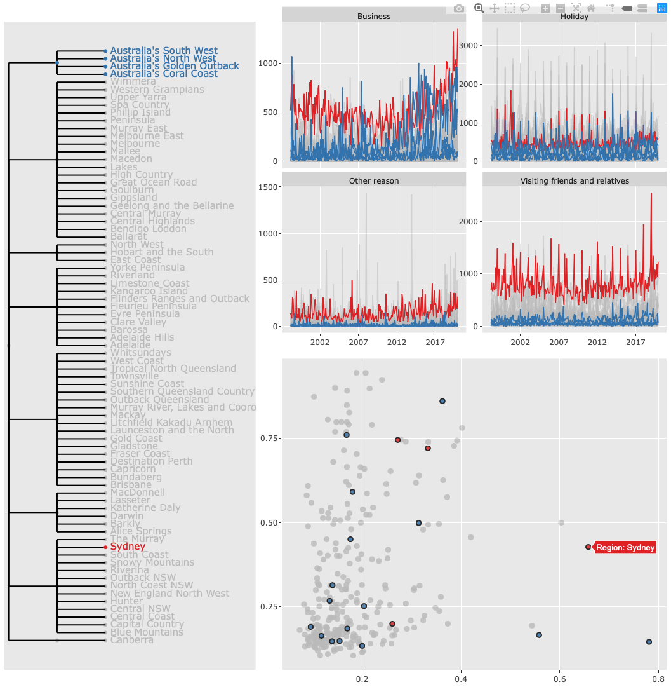
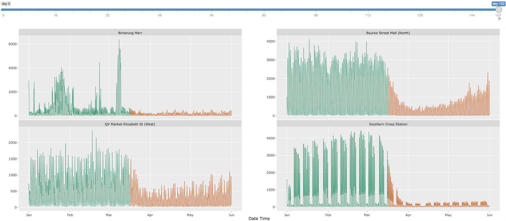

```{r setup, echo = FALSE, cache = FALSE, include = FALSE}
options("knitr.graphics.auto_pdf" = TRUE)
library(knitr)
opts_chunk$set(
  echo = FALSE, warning = FALSE, message = FALSE, comment = "#>",
  fig.path = 'figure/', fig.align = 'center', fig.show = 'hold',
  cache = TRUE, cache.path = 'cache/',
  out.width = ifelse(is_html_output(), "100%", "\\textwidth")
)
opts_knit$set(root.dir = here::here())
read_chunk("scripts/demo.R")
read_chunk("scripts/tourism.R")
read_chunk("scripts/pedestrian.R")
```

```{r, load-pkgs}
```

# Introduction

A group of cohesive observational units measured over time typically form one temporal data set. Ensemble graphics [@unwin_ensemble_2018] that bundle multi-views for a data set together, are essential for exploring and mining many different aspects of temporal data. Adding interactivity, such as linked brushing via shared observations and wrapping by time, can accelerate this process.

This article demonstrates basic usage of the \CRANpkg{tsibbletalk} package with temporal data applications for linked views and time wrapping, proceeded by brief reviews of temporal data structure and interactive graphics. 

# Background: tidy temporal data and workflow

The \CRANpkg{tsibble} package [@wang2020tsibble] introduces a unified temporal data structure, referred to as a `tsibble`, to represent time series and longitudinal data in a tidy format [@wickham2014tidy]. That said, a `tsibble` extends the `data.frame` and \CRANpkg{tibble} classes with temporally contextual metadata: `index` and `key`. The `index` declares a data column that holds time-related indices. The `key` identifies a collection of related series or panels observed over the `index`-defined period, which can comprise multiple columns. Below displays the monthly Australian retail trade turnover data (`aus_retail`), available in the \CRANpkg{tsibbledata} package [@R-tsibbledata]. The `Month` column holds year-months as `index`. The `State` together with `Industry` are the identifiers for these 152 series, highlighted as `key`. Note that the column `Series ID` could be an alternative option for setting up `key`, but `State` and `Industry` are more readable and informative. The `index` and `key` are "sticky" columns to a `tsibble`, forming critical pieces for fluent temporal data analysis later.

```{r, print-retail}
```

In the spirit of tidy data to the \CRANpkg{tidyverse} [@Wickham2019], the **tidyverts** suite features `tsibble` as the foundational data structure, in order to build a fluid and fluent pipeline for time series analysis. Besides \CRANpkg{tsibble}, the \CRANpkg{feasts} [@R-feasts] and \CRANpkg{fable} [@R-fable] packages fill the role of statistical analysis and forecasting in the **tidyverts** ecosystem. When time series analysis starts taking off, series of interest denoted by the `key` variables often remain unchanged over the course of analysis, from trend inspection to forecasting performance.

Figure \ref{fig:highlight-retail-1} gives an overview of 152 series for the retail data using an overlaid time series plot, while Figure \ref{fig:highlight-retail-2} presents a scatterplot, where each series is represented by a dot in the feature space (trend versus seasonal strength). The plot making of Figure \ref{fig:highlight-retail-2} is aided with the `features()` function from \CRANpkg{feasts}, which summarises original data by each series down to various statistical features. This function along with other **tidyverts** functions is `tsibble`-aware, and outputs a table in a reduced form where each row corresponds to a series, thus graphically displayed as Figure \ref{fig:highlight-retail-2}.

```{r highlight-retail, fig.height = 6, out.width = ".49\\linewidth", fig.show = "hold", fig.cap = "Plots for the \\code{aus\\_retail} data, with the series of strongest seasonal strength highlighted. (a) An overlaid time series plot. (b) A scatter plot drawn from their time series features, where each dot represents a time series from (a).", fig.subcap = c("", ""), fig.ncol = 2}
```

Figure \ref{fig:highlight-retail} highlights not only a series with strongest seasonality, but also a need to querying interesting series on the fly. Without interactivity, one needs to first filter the interesting series out from the features table, and join back to the original `tsibble` in order to examine its trend in relation to others. This procedure can soon grow cumbersome if many series to be discovered. Despite that the two plots are static, they can be considered as linked views via the common `key` variables between two tables. This motivates enabling interactivity of `tsibble` and `tsibble`-derived objects for rapid exploratory data analysis.

# Overview of interactivity

The R community has a long-standing contribution to interactive visualisation systems in abundance. These systems can be roughly divided into two classes: ones with web technology and the others without.

R \CRANpkg{shiny} [@R-shiny] and \CRANpkg{htmlwidgets} [@R-htmlwidgets] lay a fundamental infrastructure in marrying R with HTML elements and JavaScript for interactivity, although they seldom emphasise on interactive graphics. The \CRANpkg{htmlwidgets} package opens a door to embedding JavaScript libraries into R such that users are able to write only R code to generate web-based plots. Many JavaScript charting libraries have been ported to R as HTML widgets, including \CRANpkg{plotly} [@plotly2020], \CRANpkg{rbokeh} [@R-rbokeh], and \CRANpkg{leaflet} [@R-leaflet] for maps. To enable interactions between different widgets, it can be achieved with \CRANpkg{shiny} or \CRANpkg{crosstalk} [@R-crosstalk]. The \CRANpkg{crosstalk} extends \CRANpkg{htmlwidgets} with shared R6 instances to support linked brushing and filtering across widgets, without relying on \CRANpkg{shiny}.

If not using web technology, two examples are provided here: \CRANpkg{loon} [@R-loon] based on Tcl/Tk and \pkg{cranvas} [@xie_reactive_2014] based on Qt. They offer a wide array of pre-defined interactions, such as selecting and zooming, to manipulate plots via mouse, keyboard strokes, and menus. The \pkg{cranvastime} package [@cheng_enabling_2016] is an add-on of \pkg{cranvas}, which develops a set of novel interactions for temporal data, for example wrapping and mirroring.

# Interactivity for coordinated views via shared temporal data

The \CRANpkg{tsibbletalk} package, inspired by the \CRANpkg{crosstalk} package, introduces a shared tsibble instance on top of a `tsibble` to allow for frictionless communication between different plots for temporal data. The `as_shared_tsibble()` function provides an entry point in the integrated flow, turning a `tsibble` to a shared instance (i.e. `SharedTsibbleData` subclassing of `SharedData` from \CRANpkg{crosstalk}) that powers data transmission across multiple views. The \CRANpkg{tsibbletalk} package aims to streamline interactive graphical analysis with the focus of temporal and structured linking.

As opposed to one-to-one linking, \CRANpkg{tsibbletalk} defaults to categorical linking where marking one or more observations in one category will broadcast to all other observations in this category. Given time series plots, click any data point on a line, highlighting the whole line as a result. The `as_shared_tsibble()` uses `tsibble`'s `key` variables to achieve these types of linking, and the `spec` argument takes one step further in constructing hybrid linking, for example hierarchical and categorical linking. For example, each series in the `aus_retail` data corresponds to all possible combinations of the `State` and `Industry` variables. They are intrinsically crossed with each other. If one variable is nested within another, this lends itself to a hierarchical structure, like geographical hierarchy. Such collection of inter-related time series are referred to as hierarchical and grouped time series in the literature [@fpp].

To incorporate structured specifications in the `key`, a symbolic formula can be passed to the `spec` argument. Adopting Wilkinson notations for factorial models [@Wilkinson1973], the `spec` follows the `/` and `*` operators tradition to declare nesting and crossing variables respectively. The `spec` for the `aus_retail` data is therefore specified as `State * Industry` or `Industry * State`, which is the default for the presence of multiple `key` variables. If there is a hierarchy in the data, using `/` is required to indicate the parent-child relation, as strictly one direction `parent/child`.

The `tourism_monthly` dataset [@tourism] packaged in \CRANpkg{tsibbletalk}, contains monthly domestic overnight trips across Australia, to give an illustrator of nesting and crossing. The `key` is comprised of three identifying variables: `State`, `Region`, and `Purpose` (of trip), in particular `State` nesting of `Region`, together crossed with `Purpose`. This specification can be translated as follows:

```{r tourism-shared, echo = TRUE}
```

```{r load-other-pkgs}
```

```{r tourism-linking-fig, fig.cap = "Coordinated views generated from the \\code{tourism\\_shared} with persistent linked brushing."}

```

This dataset contains a three-level hierarchy: the root node is implicitly Australia, and geographically disaggregated to states and lower-level tourism regions. A new handy function `plotly_key_tree()` has been implemented to address the need of hierarchical discovery arising from the data. It interprets hierarchies in the shared tsibble's `spec` as a tree view, built with \CRANpkg{plotly}. The following code line produces the linked tree diagram and spans the left panel of Figure \ref{fig:tourism-linking-fig}. The visual of tree hierarchy untangles a group of related series and snapshots the data organisation from a bird's eye view.

```{r plotly-key-tree, echo = TRUE}
```

The tree plot provides backbones of the data, and much flesh yet to be attached. Small multiples of time series lines are composed and placed at the top right of Figure \ref{fig:tourism-linking-fig} to unpack the temporal trend across regions by purposes of trips. The shared tsibble data can be directly piped into \CRANpkg{ggplot2} code.

```{r tourism-series, echo = TRUE, eval = FALSE}
```

To tease apart these overlaid time series, they are funnelled through the `features()` S3 method to extract some key characteristics, including the measurements of trend and seasonality. A scatterplot is populated from these statistics for each series.

```{r tourism-scatter, echo = TRUE, eval = FALSE}
```

Lastly, three graphics are composed as an ensemble of coordinated views for multi-facetted exploration, shown as Figure \ref{fig:tourism-linking-fig} (the interactive realisation of Figure \ref{fig:highlight-retail}). Routine functions bring about new interaction with temporal data on the client side.

```{r tourism-multi, echo = TRUE, eval = FALSE}
```

Since all plots are stemmed from one shared tsibble data source, they are self-linking views. Nodes, lines, and points are hoverable and clickable. Given the `spec`, clicking either one element in any plot highlights all points that match the `Region` category, briefly "categorical linking". In Figure \ref{fig:tourism-linking-fig}, when hovering and selecting the circle associated with "Sydney" in the scatter plot, all data records with shared values of "Sydney" listen and react to this interaction via self updating in red. In order for comparison with other regions or states, press the "Shift" key to enable persistent selection, and simultaneously select the parent node on the tree, saying "Western Australia", to include all the children by switching to the blue colour. The domestic tourism sees Sydney as one of the most popular destinations in realm of business and friends visiting over years. Despite of relatively weaker performance in Western Australia, Australia's North West region sees the strongest upward trend, bypassing Sydney in some years.

In summary, shared tsibble data nicely bridges between the \CRANpkg{crosstalk} and **tidyverts** ecosystems for temporal data over their common term "key". The `as_shared_tsibble()` provides a symbolic user interface for effortless construction of a hybrid of hierarchical and categorical linkings. And the `plotly_key_tree()` in turn decodes the specification to plot a tree for data overview and navigation, accompanied with more detailed plots.

# Slicing and dicing time

The shared tsibble data leverages the `key` attribute to converse with many coordinated views, with or without \CRANpkg{shiny}. On the other hand, a second critical attribute--`index`--lays the foundational temporal context that augments the conversation. When temporal data are plotted and stretched against the entire span like Figure \ref{fig:highlight-retail-1}, it puts emphasis on the trend perception. Yet to digest periodic/aperiodic patterns, data should be wrapped over relative time units that are origin-less, such as one quarter or one day.

```{r wrap-ped, fig.show = "hold", fig.cap = "The shiny module for wrapping the \\code{pedestrian20} data.", fig.subcap = c("Initial overview state", "1-day state", "7-day state, anchoring to Monday"), fig.ncol = 1}

include_graphics("img/wrap-1.png")
include_graphics("img/wrap-7.png")
```

The city of Melbourne has sensors installed to count hourly tallies of pedestrians in order to capture downtown daily rhythms [@ped]. Figure \ref{fig:wrap-ped} shows the first five months of 2020 foot traffic at four locations, with the depiction of three pronounced slices in time. Figure \ref{fig:wrap-ped-1} unfolds all counts from January to May on their absolute time line, facetted by four sensors. On March 16, Melbourne went to the stage three lockdown due to COVID-19, seeing a significant decline in traffic volume across the city. These lines are then folded into daily and weekly sections, shown as Figure \ref{fig:wrap-ped-2} and \ref{fig:wrap-ped-3} respectively. Seasonal variations have been popped out to viewers, complementing the not-just-magnitude-drop story. The pre-lockdown period is coloured with dark green and lockdown with orange.

The wrapping procedure involves slicing time indices into seasonal periods of interest and their corresponding time dices. For example, hourly pedestrian data can be decomposed into 24-hour blocks grouped by all respective days, like Figure \ref{fig:wrap-ped-2}. Figure \ref{fig:wrap-ped} suggests that there could be more than one eye-catching slices out of many possible combinations, and thus repeated wrappings can be unwieldy. To visually locate a salient slice, the \CRANpkg{tsibbletalk} package implements a shiny module, a pair of UI and server functions, to automate this wrapping procedure.

This shiny module, decoupled to `tsibbleWrapUI()` and `tsibbleWrapServer()`, presents a clean interface and forms a resusable piece in a shiny application. A shiny module provides the vehicle in modularising shiny applications for both users and developers. Like all shiny modules, the first argument in both functions requires a user-supplied session id that must be unique. The UI function `tsibbleWrapUI()` simply shows a slider that animates or controls the number of periods to be diced. The workhorse is certainly the server function `tsibbleWrapServer()`, encapsulating the algorithm that transforms data and sends messages to update the plot accordingly. The `plot` argument expects a `ggplot` or `plotly` object, where one can plot data using either lines or other graphical elements (such as boxplots). As the function name suggests, a (shared) tsibble is needed to start the engine, and thereby the time `index` can be retrieved for dissection. The `period` option semantically takes a desired number of seasonal periods to be shifted, for example data shifted by "1 day", "2 days", or "1 week", etc. In other words, the `period` defines the grind level. For date-times (represented by `POSIXt`), the granularity ranges from fine "day" to coarse "year". The following code snippet generates Figure \ref{fig:wrap-ped}.

```{r load-ped, eval = FALSE}
```

```{r ped-slice, echo = TRUE, eval = FALSE}
```

Upon running the shiny application, Figure \ref{fig:wrap-ped-1} corresponds to the initial state, with the slider incremented by 1-day unit. The "play" button near the end of slider begins animating the slicing and dicing process by walking through all 24 hours by 152 days. Alternatively, users can drag the handler to poke around certain slices themselves.

In response to the slider input, the plot will be updated and loaded with newly transformed data. At its core, keeping the application as performant as possible is the top priority. Without completely redrawing the plot, the `plotlyProxy()` react method is invoked internally for talking to shiny. The underlying tsibble data is being called back and processed in R. Only transformed data gets fed back to the shiny server, along with reseting the x-axis ranges and breaks. The rest plot configurations, such as marks, y-axes, and layouts, are properly cached.

The new shiny module exploits the temporal aspect for a tsibble object, exposed by the `index` attribute. It allows users to slide through relative periods to digest seasonal behaviours, with slick user experience.

# Summary

Close to the heart of the \CRANpkg{tsibbletalk} package is blending the best bits from \CRANpkg{tsibble}, \CRANpkg{crosstalk}, \CRANpkg{plotly}, and \CRANpkg{shiny}.

The `as_shared_tsibble()` turns a `tsibble` object to a shared data class, with an option to express any nesting and crossing structures from the `key` attribute. If nesting is found in the data, the `plotly_key_tree()` creates an interactive hierarchical tree to help with data overview. This sets the stage for hierarchical and categorical linking between multi-views from one shared tsibble.

A new shiny module, `tsibbleWrapUI()` and `tsibbleWrapServer()`, provides a lens for looking at temporal aspects for a `tsibble`, in particular seasonal or cyclical variations. The slicing and dicing technique efficiently wrap time lines for user-defined plots. The `plotlyProxy()` react method makes it possible to send wrapped data to the server and amend the plot straight way.

# References

```{r pkg-bib, eval = FALSE}
pkgs <- c("tsibbledata", "feasts", "fable", "shiny", "htmlwidgets", "plotly",
  "rbokeh", "leaflet", "crosstalk", "loon")
write_bib(pkgs, "rpkgs.bib")
```

